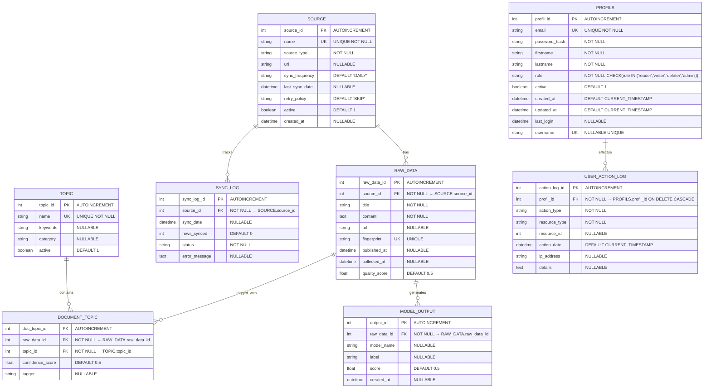

# 📊 DIAGRAMME ER COMPLET - Toutes les Tables (E1 + PROFILS + USER_ACTION_LOG)

## 🎯 VUE D'ENSEMBLE

**8 tables au total** :
- **6 tables E1** : SOURCE, RAW_DATA, SYNC_LOG, TOPIC, DOCUMENT_TOPIC, MODEL_OUTPUT
- **2 tables isolées** : PROFILS, USER_ACTION_LOG

---

## 📊 DIAGRAMME ER MERISE COMPLET



---

## 🔗 RELATIONS DÉTAILLÉES

### **Relations E1 (5 relations)**

1. **SOURCE → RAW_DATA** (1 → N)
   - Une source a plusieurs articles
   - FK : `raw_data.source_id` → `source.source_id`

2. **SOURCE → SYNC_LOG** (1 → N)
   - Une source a plusieurs logs de synchronisation
   - FK : `sync_log.source_id` → `source.source_id`

3. **RAW_DATA → DOCUMENT_TOPIC** (1 → N)
   - Un article a plusieurs topics (max 2)
   - FK : `document_topic.raw_data_id` → `raw_data.raw_data_id`

4. **RAW_DATA → MODEL_OUTPUT** (1 → N)
   - Un article a plusieurs prédictions ML (sentiment, etc.)
   - FK : `model_output.raw_data_id` → `raw_data.raw_data_id`

5. **TOPIC → DOCUMENT_TOPIC** (1 → N)
   - Un topic est assigné à plusieurs articles
   - FK : `document_topic.topic_id` → `topic.topic_id`

### **Relations Isolées (1 relation)**

6. **PROFILS → USER_ACTION_LOG** (1 → N)
   - Un utilisateur a plusieurs actions loggées
   - FK : `user_action_log.profil_id` → `profils.profil_id`
   - **ON DELETE CASCADE** : Si utilisateur supprimé, ses logs aussi

---

## 📊 SCHÉMA VISUEL COMPLET

```
┌─────────────────────────────────────────────────────────────┐
│                    TABLES E1 (6 tables)                     │
└─────────────────────────────────────────────────────────────┘

    SOURCE (1)
    ├── source_id (PK)
    └── name
    
         │ 1
         │
         ├──→ N RAW_DATA
         │      ├── raw_data_id (PK)
         │      ├── source_id (FK)
         │      └── title, content, fingerprint
         │
         │          ├──→ N DOCUMENT_TOPIC
         │          │      ├── doc_topic_id (PK)
         │          │      ├── raw_data_id (FK)
         │          │      └── topic_id (FK)
         │          │
         │          └──→ N MODEL_OUTPUT
         │                 ├── output_id (PK)
         │                 └── raw_data_id (FK)
         │
         └──→ N SYNC_LOG
                ├── sync_log_id (PK)
                └── source_id (FK)

    TOPIC (1)
    ├── topic_id (PK)
    └── name
    
         └──→ N DOCUMENT_TOPIC
                └── topic_id (FK)

┌─────────────────────────────────────────────────────────────┐
│              TABLES ISOLÉES (2 tables)                      │
│         (Aucune FK dans les tables E1)                      │
└─────────────────────────────────────────────────────────────┘

    PROFILS (1)
    ├── profil_id (PK)
    └── email, password_hash, role
    
         └──→ N USER_ACTION_LOG
                ├── action_log_id (PK)
                ├── profil_id (FK)
                ├── resource_type ('raw_data', 'source', etc.)
                └── resource_id (référence indirecte aux ressources E1)
```

---

## ✅ ISOLATION DES TABLES

### **Principe**

**PROFILS et USER_ACTION_LOG sont isolées** :
- ❌ **Aucune FK dans RAW_DATA** (pas de `created_by`)
- ❌ **Aucune FK dans SOURCE** (pas de `created_by`)
- ❌ **Aucune FK dans les autres tables E1**

### **Référence Indirecte**

**USER_ACTION_LOG** référence les ressources E1 via :
- `resource_type` : Type de ressource ('raw_data', 'source', 'export', etc.)
- `resource_id` : ID de la ressource (raw_data_id, source_id, etc.)

**Exemple** :
```
USER_ACTION_LOG
├── resource_type = 'raw_data'
└── resource_id = 456  ← Référence indirecte à RAW_DATA.raw_data_id = 456
```

**Pas de FK** dans RAW_DATA, mais on peut quand même savoir qui a créé l'article 456 via une requête JOIN.

---

## 📋 RÉCAPITULATIF DES TABLES

| Table | Type | PK | FK | Relations |
|-------|------|----|----|-----------| 
| **SOURCE** | E1 | source_id | - | → RAW_DATA, SYNC_LOG |
| **RAW_DATA** | E1 | raw_data_id | source_id | ← SOURCE, → DOCUMENT_TOPIC, MODEL_OUTPUT |
| **SYNC_LOG** | E1 | sync_log_id | source_id | ← SOURCE |
| **TOPIC** | E1 | topic_id | - | → DOCUMENT_TOPIC |
| **DOCUMENT_TOPIC** | E1 | doc_topic_id | raw_data_id, topic_id | ← RAW_DATA, TOPIC |
| **MODEL_OUTPUT** | E1 | output_id | raw_data_id | ← RAW_DATA |
| **PROFILS** | Isolée | profil_id | - | → USER_ACTION_LOG |
| **USER_ACTION_LOG** | Isolée | action_log_id | profil_id | ← PROFILS |

---

## 🎯 RÉSUMÉ

### **Tables E1 (6 tables)**
- ✅ **SOURCE** : Métadonnées des sources de données
- ✅ **RAW_DATA** : Articles bruts collectés
- ✅ **SYNC_LOG** : Historique de synchronisation
- ✅ **TOPIC** : Topics prédéfinis
- ✅ **DOCUMENT_TOPIC** : Association articles ↔ topics
- ✅ **MODEL_OUTPUT** : Prédictions ML (sentiment, etc.)

### **Tables Isolées (2 tables)**
- ✅ **PROFILS** : Utilisateurs (authentification future)
- ✅ **USER_ACTION_LOG** : Journalisation des actions (audit)

### **Isolation**
- ✅ **OUI**, PROFILS et USER_ACTION_LOG sont isolées des tables E1
- ✅ **Aucune FK** dans les tables E1
- ✅ **Référence indirecte** via `resource_type` + `resource_id`
- ✅ **Code E1 intact** : Pipeline fonctionne normalement

---

**Status** : ✅ **DIAGRAMME ER COMPLET - 8 TABLES (6 E1 + 2 ISOLÉES)**
