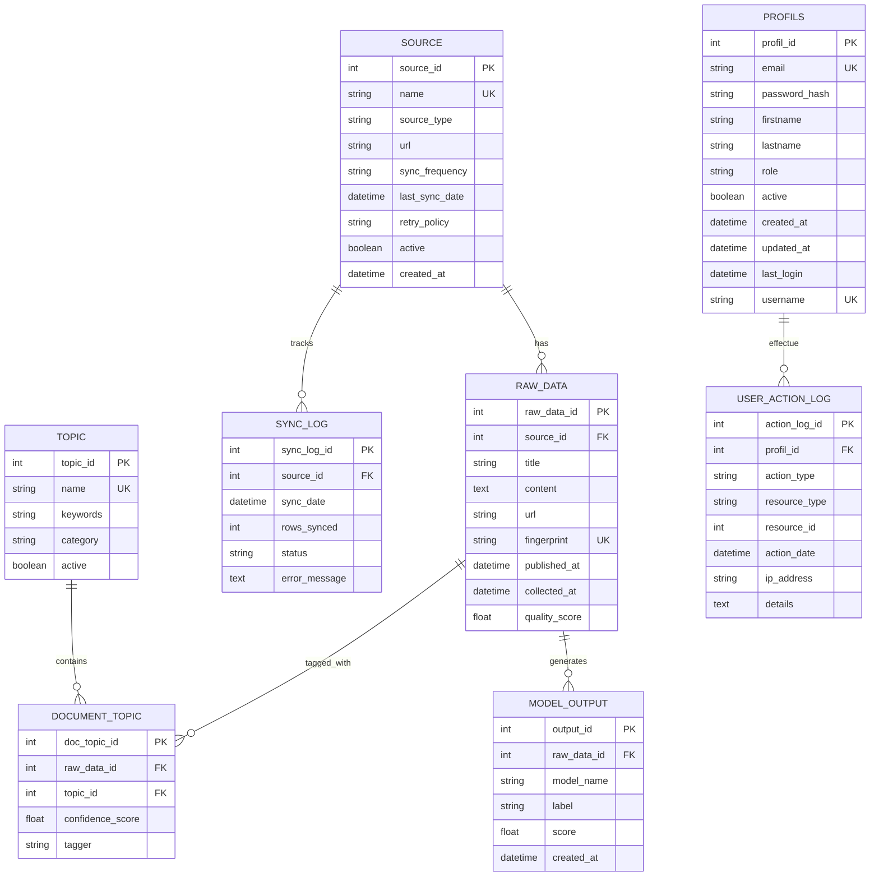

# 📊 DIAGRAMME ER COMPLET - DataSens E1 + PROFILS

## 🎯 Vue d'Ensemble

**Tables E1** : 6 tables core (existant)  
**Tables Authentification** : 2 tables (PROFILS + USER_ACTION_LOG)  
**Total** : 8 tables

---

## 📊 DIAGRAMME ER MERISE COMPLET

---

## 🔗 RELATIONS

### **Relations E1 (Existant)**

1. **SOURCE → RAW_DATA** (1 → N)
   - Une source a plusieurs articles
   - FK : `raw_data.source_id` → `source.source_id`

2. **SOURCE → SYNC_LOG** (1 → N)
   - Une source a plusieurs logs de synchronisation
   - FK : `sync_log.source_id` → `source.source_id`

3. **RAW_DATA → DOCUMENT_TOPIC** (1 → N)
   - Un article a plusieurs topics
   - FK : `document_topic.raw_data_id` → `raw_data.raw_data_id`

4. **RAW_DATA → MODEL_OUTPUT** (1 → N)
   - Un article a plusieurs prédictions ML
   - FK : `model_output.raw_data_id` → `raw_data.raw_data_id`

5. **TOPIC → DOCUMENT_TOPIC** (1 → N)
   - Un topic est assigné à plusieurs articles
   - FK : `document_topic.topic_id` → `topic.topic_id`

### **Relations Authentification (Nouveau)**

6. **PROFILS → USER_ACTION_LOG** (1 → N)
   - Un utilisateur a plusieurs actions loggées
   - FK : `user_action_log.profil_id` → `profils.profil_id`
   - **ISOLÉE** : Pas de relation avec tables E1 (pour l'instant)

---

## 📋 ATTRIBUTS PAR TABLE

### **PROFILS**

| Attribut | Type | Contraintes | Description |
|----------|------|-------------|-------------|
| `profil_id` | INTEGER | PK, AUTOINCREMENT | Identifiant unique |
| `email` | VARCHAR(255) | UNIQUE, NOT NULL | Email (identifiant de connexion) |
| `password_hash` | VARCHAR(255) | NOT NULL | Hash du mot de passe |
| `firstname` | VARCHAR(100) | NOT NULL | Prénom |
| `lastname` | VARCHAR(100) | NOT NULL | Nom |
| `role` | VARCHAR(20) | NOT NULL, CHECK | Rôle : 'reader', 'writer', 'deleter', 'admin' |
| `active` | BOOLEAN | DEFAULT 1 | Compte actif/désactivé |
| `created_at` | DATETIME | DEFAULT CURRENT_TIMESTAMP | Date de création |
| `updated_at` | DATETIME | DEFAULT CURRENT_TIMESTAMP | Dernière modification |
| `last_login` | DATETIME | NULLABLE | Dernière connexion |
| `username` | VARCHAR(50) | NULLABLE, UNIQUE | Nom d'utilisateur (optionnel) |

### **USER_ACTION_LOG**

| Attribut | Type | Contraintes | Description |
|----------|------|-------------|-------------|
| `action_log_id` | INTEGER | PK, AUTOINCREMENT | Identifiant unique |
| `profil_id` | INTEGER | FK, NOT NULL | Utilisateur |
| `action_type` | VARCHAR(50) | NOT NULL | Type d'action |
| `resource_type` | VARCHAR(50) | NOT NULL | Type de ressource |
| `resource_id` | INTEGER | NULLABLE | ID de la ressource |
| `action_date` | DATETIME | DEFAULT CURRENT_TIMESTAMP | Date/heure de l'action |
| `ip_address` | VARCHAR(45) | NULLABLE | IP de l'utilisateur |
| `details` | TEXT | NULLABLE | Détails supplémentaires (JSON) |

---

## ✅ INTÉGRATION RÉALISÉE

### **Modifications Apportées**

1. ✅ **`src/repository.py`** :
   - Ajout méthode `_ensure_profils_table()`
   - Appel automatique dans `_ensure_schema()`
   - Migration-safe (vérifie si table existe avant création)

2. ✅ **Documentation** :
   - `docs/SCHEMA_PROFILS.md` : Documentation complète
   - `docs/ER_DIAGRAM_COMPLET.md` : Ce fichier (diagramme complet)

### **Compatibilité**

- ✅ **Aucun breaking change** : Tables E1 intactes
- ✅ **Migration automatique** : Table créée au prochain lancement
- ✅ **Code existant fonctionne** : Pipeline E1 non impacté
- ✅ **Préparé pour E2** : Prêt pour authentification web/API

---

## 🚀 PROCHAINES ÉTAPES (Futur - E2)

1. **Méthodes CRUD dans Repository** :
   - `create_profil()`
   - `authenticate()`
   - `get_profil_by_email()`
   - `update_profil()`
   - `log_user_action()`

2. **Authentification Web (FastAPI)** :
   - Endpoint `/auth/login`
   - Endpoint `/auth/register`
   - Middleware JWT
   - Décorateurs de permissions

3. **Intégration avec Tables E1** (Optionnel) :
   - FK `raw_data.created_by` → `profils.profil_id`
   - FK `source.created_by` → `profils.profil_id`
   - Audit trail complet

---

**Status** : ✅ **INTÉGRÉ - PRÊT POUR UTILISATION FUTURE**
