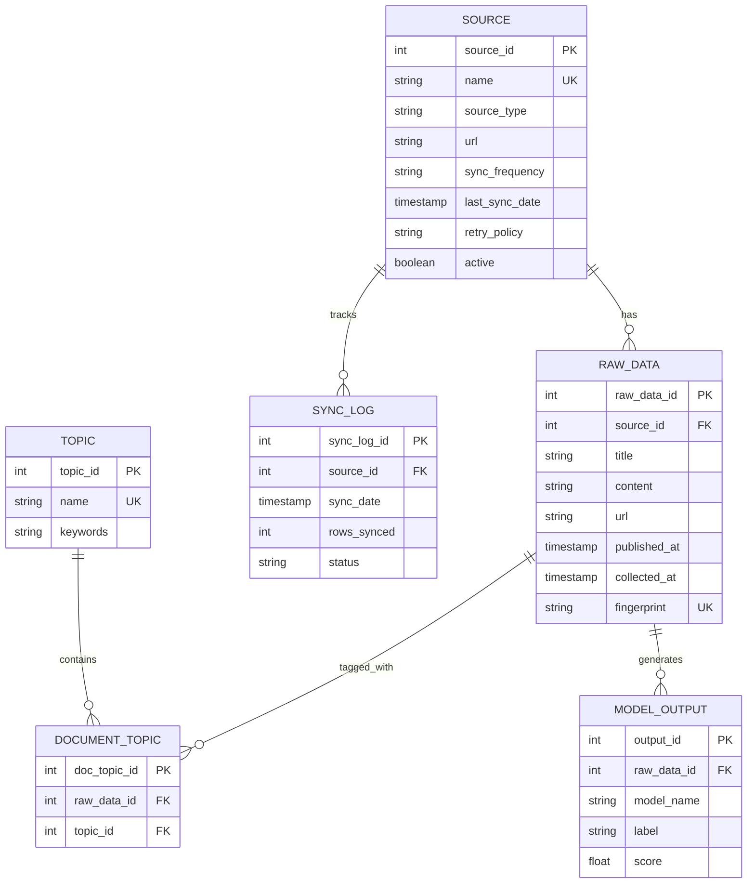

# DataSens Schema: E1 vs E2/E3

## E1: 6 CORE TABLES (MVP - Production)

These 6 tables are ALL you need for E1:

| Table | Purpose | Rows |
|-------|---------|------|
| `source` | Metadata: 10 data sources + scheduling | ~10 |
| `raw_data` | All ingested articles (RAW zone) | ~380 |
| `sync_log` | Sync history per source | ~10 |
| `topic` | 22 predefined topics | ~22 |
| `document_topic` | Maps articles to topics | ~variable |
| `model_output` | ML predictions (sentiment, labels) | ~variable |

### Source Table Schema (UPDATED)

```sql
CREATE TABLE source (
    source_id INTEGER PRIMARY KEY,
    name TEXT UNIQUE,
    source_type TEXT,
    url TEXT,
    sync_frequency TEXT,        -- DAILY, WEEKLY, MONTHLY, YEARLY
    last_sync_date TIMESTAMP,   -- When last synchronized
    retry_policy TEXT,          -- SKIP, FALLBACK_PREVIOUS_YEAR
    active BOOLEAN              -- Enable/disable source
);
```

**Key Features:**
- `sync_frequency`: Prevents duplicate ingestion. DAILY sources only sync once/day
- `last_sync_date`: Tracks last successful sync to avoid redundant processing
- `retry_policy`: FALLBACK_PREVIOUS_YEAR for annual data (e.g., IFOP barometers)
- `active`: Toggle sources on/off without deleting configuration

**Total footprint:** ~1-2 MB SQLite

**What E1 does:**
- Ingests from 10 sources (RSS, API, WebScraping)
- Smart scheduling: DAILY/WEEKLY/MONTHLY/YEARLY frequencies
- Automatic fallback for missing data (e.g., previous year barometers)
- Deduplicates + quality checks (in-memory)
- Tags with 22 topics
- Generates ML predictions
- Exports to GOLD zone (Parquet) ready for IA fine-tuning

### Scheduling Logic (NEW)

**How it works:**

1. **Load sources_config.json** with all source metadata
2. **Check last_sync_date** against sync_frequency
3. **Skip if too recent** (optimization)
4. **Ingest if due** (new or updated data)
5. **Update last_sync_date** after successful sync

**Example:**
```
rss_french_news (DAILY):
  - Last sync: 2025-12-15 10:00
  - Now: 2025-12-15 14:00
  - Days passed: 0
  - Should ingest? YES (< 1 day threshold)

ifop_barometers (YEARLY):
  - Last sync: 2024-12-15
  - Now: 2025-12-15
  - Days passed: 365
  - Should ingest? YES (>= 365 day threshold)
  - Try 2025 data, fallback to 2024 if unavailable
```

**Configuration File: sources_config.json**

```json
{
  "sources": [
    {
      "name": "rss_french_news",
      "type": "RSS",
      "url": "https://www.france24.com/fr/en-direct/rss",
      "sync_frequency": "DAILY",
      "retry_policy": "SKIP",
      "active": true,
      "count": 50
    },
    {
      "name": "ifop_barometers",
      "type": "WebScraping",
      "url": "https://www.ifop.com/",
      "sync_frequency": "YEARLY",
      "retry_policy": "FALLBACK_PREVIOUS_YEAR",
      "active": true,
      "count": 50,
      "notes": "Annual barometer - use previous year if current unavailable"
    }
  ]
}
```

**Retry Policies:**
- `SKIP`: If fetch fails, skip this source
- `FALLBACK_PREVIOUS_YEAR`: Try current year, fallback to previous year (barometers)

### ER Diagram: E1 Tables & Relationships



**Relationships:**
- 1 SOURCE → Many RAW_DATA (one source has multiple articles)
- 1 SOURCE → Many SYNC_LOG (track sync history per source)
- 1 RAW_DATA → Many DOCUMENT_TOPIC (article can have multiple topics)
- 1 RAW_DATA → Many MODEL_OUTPUT (multiple ML predictions per article)
- 1 TOPIC → Many DOCUMENT_TOPIC (topic applied to many articles)

**Data Flow:**
```
SOURCE (config) → INGEST → RAW_DATA → CLEAN → DOCUMENT_TOPIC + MODEL_OUTPUT → EXPORT GOLD (Parquet)
                                     ↓
                              SYNC_LOG (tracking)
```

---

## CHANGELOG & UPDATES

### December 15, 2025 - Smart Scheduling & Production ETL

**What Changed:**

1. **Extended `source` table** with scheduling columns:
   - `sync_frequency`: DAILY, WEEKLY, MONTHLY, YEARLY
   - `last_sync_date`: Track synchronization timing
   - `retry_policy`: SKIP or FALLBACK_PREVIOUS_YEAR
   - `active`: Enable/disable sources

2. **Added sources_config.json** for centralized configuration:
   - All 10 sources defined with schedules
   - Easy to add/modify sources
   - IFOP barometers use FALLBACK_PREVIOUS_YEAR
   - Daily sources don't re-ingest unnecessarily

3. **Updated Cell 3 (INGEST) in E1_UNIFIED_MINIMAL.ipynb**:
   - `should_ingest()` function: Checks if source needs sync
   - Smart scheduling prevents redundant processing
   - Fallback logic for annual data (2024 if 2025 unavailable)
   - `last_sync_date` updated automatically

**Why This Matters:**

- **Cost optimization**: Don't fetch same RSS feed multiple times/day
- **Data freshness**: Monthly sources only sync once/month
- **Resilience**: Barometers work even if current year unavailable
- **Maintenance**: Add sources by editing JSON, not code

**Files Modified:**
- `E1_UNIFIED_MINIMAL.ipynb` (Cell 2: schema, Cell 3: ingest)
- `sources_config.json` (NEW)

**Files Updated:**
- `SCHEMA_DESIGN.md` (THIS FILE)

---

These tables are added LATER for E2/E3 features:

| Table | Purpose | When |
|-------|---------|------|
| `raw_data_cleaned` | SILVER zone persistent storage | E2 (Parquet export) |
| `data_quality_metrics` | Quality tracking per source | E2 (monitoring) |
| `cleaning_audit` | Audit trail for data changes | E2 (compliance) |
| `feature_engineering_log` | Feature store for ML | E3 (advanced ML) |
| `sync_checkpoint` | Resume failed syncs | E2 (reliability) |
| `sync_config` | Per-source parameters | E2 (configuration) |
| `ml_model_registry` | Multi-model management | E3 (A/B testing) |
| `partition_metadata` | Spark partition info | E2 (big data) |
| `schema_evolution` | Track schema changes | E2 (versioning) |
| `performance_metrics` | Timing/profiling data | E3 (optimization) |
| `error_log` | Centralized error tracking | E2 (observability) |

**When to add:** Only if you need the specific feature (E2/E3)

---

## Design Philosophy

**E1 = Minimal + Functional**
- 6 tables, fits in memory
- No external dependencies (SQLite)
- Fast iteration
- Perfect for prototyping

**E2/E3 = Scale + Enterprise**
- Add tables as needed
- Parquet export → Big data tools
- API layer (FastAPI)
- Dashboard (Streamlit)
- Multi-tenancy, monitoring, etc.

---

## Current Implementation

**E1_UNIFIED_MINIMAL.ipynb uses ONLY 6 tables:**
- Cell 1: Imports + DB setup
- Cell 2: Schema (6 tables only)
- Cell 3: Ingest 10 sources
- Cell 4: Quality checks (in-memory)
- Cell 5: Final metrics

**Notebooks 06-09:** Use only these 6 tables
- 06: Topics tagging
- 07: Manual sources
- 08: Quality validation
- 09: Model output

---

## Action Items

**✅ DONE - E1 Consolidated:**
- Removed 12 unnecessary tables from E1
- Kept only 6 core tables
- Quality checks run in-memory (no separate SILVER DB)

**📋 READY FOR E2/E3:**
- Phase 05: Export to Parquet (add `raw_data_cleaned` table)
- Phase 07: API (use 6 core tables + new endpoint layer)
- Phase 08: Dashboard (use 6 core tables + new visualizations)

**Memory Note:** These 11 tables will be created/used in E2/E3 notebooks.
