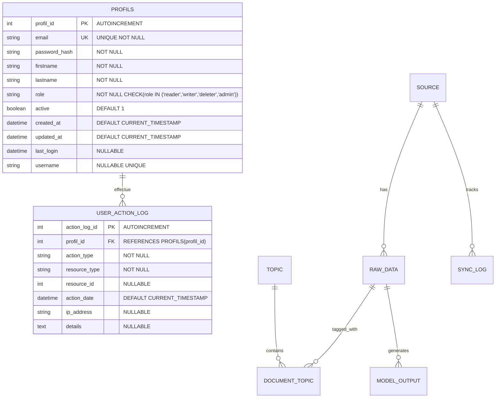

# 👤 SCHÉMA PROFILS - Authentification Future

## 📊 DIAGRAMME ER MERISE



---

## 📋 ATTRIBUTS PROPOSÉS + COMPLÉMENTS

### **Table PROFILS**

| Attribut | Type | Contraintes | Description |
|----------|------|-------------|-------------|
| `profil_id` | INTEGER | PK, AUTOINCREMENT | Identifiant unique |
| `email` | VARCHAR(255) | UNIQUE, NOT NULL | Email (identifiant de connexion) |
| `password_hash` | VARCHAR(255) | NOT NULL | Hash du mot de passe (bcrypt/argon2) |
| `firstname` | VARCHAR(100) | NOT NULL | Prénom |
| `lastname` | VARCHAR(100) | NOT NULL | Nom |
| `role` | VARCHAR(20) | NOT NULL, CHECK | Rôle : 'reader', 'writer', 'deleter', 'admin' |
| `active` | BOOLEAN | DEFAULT 1 | Compte actif/désactivé |
| `created_at` | DATETIME | DEFAULT CURRENT_TIMESTAMP | Date de création |
| `updated_at` | DATETIME | DEFAULT CURRENT_TIMESTAMP | Dernière modification |
| `last_login` | DATETIME | NULLABLE | Dernière connexion |
| `username` | VARCHAR(50) | NULLABLE, UNIQUE | Nom d'utilisateur (optionnel) |

**Attributs ajoutés** :
- ✅ `password_hash` : **OBLIGATOIRE** pour authentification
- ✅ `active` : Désactiver compte sans supprimer
- ✅ `created_at` / `updated_at` : Audit trail
- ✅ `last_login` : Suivi des connexions
- ✅ `username` : Optionnel (email peut servir d'identifiant)

---

## 🔗 RELATIONS (Futures - Optionnelles)

### **Table USER_ACTION_LOG** (Optionnelle - Pour E2)

**Objectif** : Tracker les actions des utilisateurs (audit, sécurité)

| Attribut | Type | Description |
|----------|------|-------------|
| `action_log_id` | INTEGER PK | Identifiant |
| `profil_id` | INTEGER FK | Utilisateur |
| `action_type` | VARCHAR(50) | 'read', 'write', 'delete', 'export', 'login' |
| `resource_type` | VARCHAR(50) | 'raw_data', 'source', 'export', 'dashboard' |
| `resource_id` | INTEGER | ID de la ressource (NULL si action globale) |
| `action_date` | DATETIME | Date/heure de l'action |
| `ip_address` | VARCHAR(45) | IP de l'utilisateur |
| `details` | TEXT | Détails supplémentaires (JSON) |

**Relation** : `PROFILS` 1 → N `USER_ACTION_LOG`

---

## 🔧 INTÉGRATION SANS CASSER LE CODE

### **Stratégie : Table Isolée (Pas de FK Obligatoire)**

**Principe** :
- ✅ Table `PROFILS` créée **indépendamment** des tables E1 existantes
- ✅ **Aucune FK obligatoire** dans les tables E1 actuelles
- ✅ Compatible avec le code existant (pas de modification requise)
- ✅ Préparé pour l'avenir (E2 : authentification web, API)

---

## 📝 SCRIPT SQL DE CRÉATION

```sql
-- ============================================================================
-- TABLE PROFILS - Authentification Future
-- ============================================================================
-- Cette table est ISOLÉE des tables E1 existantes
-- Aucune modification des tables E1 requise
-- Compatible avec le code existant (pas de breaking changes)
-- ============================================================================

CREATE TABLE IF NOT EXISTS profils (
    profil_id INTEGER PRIMARY KEY AUTOINCREMENT,
    email VARCHAR(255) UNIQUE NOT NULL,
    password_hash VARCHAR(255) NOT NULL,
    firstname VARCHAR(100) NOT NULL,
    lastname VARCHAR(100) NOT NULL,
    role VARCHAR(20) NOT NULL CHECK(role IN ('reader', 'writer', 'deleter', 'admin')),
    active BOOLEAN DEFAULT 1,
    created_at DATETIME DEFAULT CURRENT_TIMESTAMP,
    updated_at DATETIME DEFAULT CURRENT_TIMESTAMP,
    last_login DATETIME,
    username VARCHAR(50) UNIQUE
);

-- Index pour performance
CREATE INDEX IF NOT EXISTS idx_profils_email ON profils(email);
CREATE INDEX IF NOT EXISTS idx_profils_role ON profils(role);
CREATE INDEX IF NOT EXISTS idx_profils_active ON profils(active);

-- ============================================================================
-- TABLE USER_ACTION_LOG (Optionnelle - Pour E2)
-- ============================================================================
-- Table d'audit pour tracker les actions des utilisateurs
-- Créée maintenant mais utilisée plus tard (E2 : authentification web)

CREATE TABLE IF NOT EXISTS user_action_log (
    action_log_id INTEGER PRIMARY KEY AUTOINCREMENT,
    profil_id INTEGER NOT NULL REFERENCES profils(profil_id) ON DELETE CASCADE,
    action_type VARCHAR(50) NOT NULL,
    resource_type VARCHAR(50) NOT NULL,
    resource_id INTEGER,
    action_date DATETIME DEFAULT CURRENT_TIMESTAMP,
    ip_address VARCHAR(45),
    details TEXT
);

-- Index pour performance
CREATE INDEX IF NOT EXISTS idx_action_log_profil ON user_action_log(profil_id);
CREATE INDEX IF NOT EXISTS idx_action_log_date ON user_action_log(action_date);
CREATE INDEX IF NOT EXISTS idx_action_log_type ON user_action_log(action_type);
```

---

## 🚀 INTÉGRATION DANS LE CODE

### **Option 1 : Migration Automatique (Recommandé)**

**Modifier `src/repository.py`** :

```python
def _ensure_schema(self):
    """Create database schema if it doesn't exist"""
    try:
        # Check if tables exist
        self.cursor.execute("SELECT name FROM sqlite_master WHERE type='table' AND name='source'")
        if self.cursor.fetchone():
            # Schema exists - Check if profils table exists
            self.cursor.execute("SELECT name FROM sqlite_master WHERE type='table' AND name='profils'")
            if not self.cursor.fetchone():
                # Add profils table (migration)
                self._create_profils_table()
            return  # Schema already exists
        
        # Create 6 core tables E1
        sql_tables = """
        -- ... (tables E1 existantes) ...
        """
        self.cursor.executescript(sql_tables)
        
        # Create profils table (new)
        self._create_profils_table()
        
    except Exception as e:
        print(f"   ⚠️  Schema error: {str(e)[:40]}")

def _create_profils_table(self):
    """Create PROFILS table (isolated, no FK in E1 tables)"""
    sql_profils = """
    CREATE TABLE IF NOT EXISTS profils (
        profil_id INTEGER PRIMARY KEY AUTOINCREMENT,
        email VARCHAR(255) UNIQUE NOT NULL,
        password_hash VARCHAR(255) NOT NULL,
        firstname VARCHAR(100) NOT NULL,
        lastname VARCHAR(100) NOT NULL,
        role VARCHAR(20) NOT NULL CHECK(role IN ('reader', 'writer', 'deleter', 'admin')),
        active BOOLEAN DEFAULT 1,
        created_at DATETIME DEFAULT CURRENT_TIMESTAMP,
        updated_at DATETIME DEFAULT CURRENT_TIMESTAMP,
        last_login DATETIME,
        username VARCHAR(50) UNIQUE
    );
    
    CREATE INDEX IF NOT EXISTS idx_profils_email ON profils(email);
    CREATE INDEX IF NOT EXISTS idx_profils_role ON profils(role);
    CREATE INDEX IF NOT EXISTS idx_profils_active ON profils(active);
    
    CREATE TABLE IF NOT EXISTS user_action_log (
        action_log_id INTEGER PRIMARY KEY AUTOINCREMENT,
        profil_id INTEGER NOT NULL REFERENCES profils(profil_id) ON DELETE CASCADE,
        action_type VARCHAR(50) NOT NULL,
        resource_type VARCHAR(50) NOT NULL,
        resource_id INTEGER,
        action_date DATETIME DEFAULT CURRENT_TIMESTAMP,
        ip_address VARCHAR(45),
        details TEXT
    );
    
    CREATE INDEX IF NOT EXISTS idx_action_log_profil ON user_action_log(profil_id);
    CREATE INDEX IF NOT EXISTS idx_action_log_date ON user_action_log(action_date);
    """
    self.cursor.executescript(sql_profils)
    self.conn.commit()
```

---

### **Option 2 : Script de Migration Séparé**

**Créer `scripts/migrate_add_profils.py`** :

```python
#!/usr/bin/env python3
"""Migration : Ajouter table PROFILS"""
import sqlite3
import sys
from pathlib import Path

def migrate(db_path: str):
    conn = sqlite3.connect(db_path)
    cursor = conn.cursor()
    
    # Vérifier si table existe déjà
    cursor.execute("SELECT name FROM sqlite_master WHERE type='table' AND name='profils'")
    if cursor.fetchone():
        print("✅ Table PROFILS existe déjà")
        return
    
    # Créer table PROFILS
    sql = """
    CREATE TABLE IF NOT EXISTS profils (
        profil_id INTEGER PRIMARY KEY AUTOINCREMENT,
        email VARCHAR(255) UNIQUE NOT NULL,
        password_hash VARCHAR(255) NOT NULL,
        firstname VARCHAR(100) NOT NULL,
        lastname VARCHAR(100) NOT NULL,
        role VARCHAR(20) NOT NULL CHECK(role IN ('reader', 'writer', 'deleter', 'admin')),
        active BOOLEAN DEFAULT 1,
        created_at DATETIME DEFAULT CURRENT_TIMESTAMP,
        updated_at DATETIME DEFAULT CURRENT_TIMESTAMP,
        last_login DATETIME,
        username VARCHAR(50) UNIQUE
    );
    
    CREATE INDEX IF NOT EXISTS idx_profils_email ON profils(email);
    CREATE INDEX IF NOT EXISTS idx_profils_role ON profils(role);
    """
    
    cursor.executescript(sql)
    conn.commit()
    conn.close()
    print("✅ Table PROFILS créée avec succès")

if __name__ == "__main__":
    db_path = sys.argv[1] if len(sys.argv) > 1 else "datasens.db"
    migrate(db_path)
```

**Exécution** :
```bash
python scripts/migrate_add_profils.py
```

---

## ✅ AVANTAGES DE CETTE APPROCHE

1. ✅ **Pas de Breaking Changes** : Aucune modification des tables E1
2. ✅ **Code Existant Intact** : Pipeline E1 fonctionne normalement
3. ✅ **Migration Progressive** : Table créée maintenant, utilisée plus tard
4. ✅ **Merise Relationnel** : Respecte les règles de normalisation
5. ✅ **Préparé pour E2** : Prêt pour authentification web/API
6. ✅ **Isolation** : Table isolée, pas de dépendances circulaires

---

## 📊 RÔLES ET PERMISSIONS

### **Définition des Rôles**

| Rôle | Permissions | Description |
|------|-------------|-------------|
| `reader` | Lecture seule | Consulter données, exports, dashboard |
| `writer` | Lecture + Écriture | Ajouter/modifier sources, données |
| `deleter` | Lecture + Écriture + Suppression | Supprimer données, sources |
| `admin` | Tous droits | Gestion utilisateurs, configuration |

**Implémentation Future (E2)** :
- Middleware d'authentification (JWT tokens)
- Décorateurs de permissions (`@require_role('admin')`)
- Vérification dans les endpoints API

---

## 🔐 SÉCURITÉ (Futur)

### **Hash de Mot de Passe**

**Recommandation** : Utiliser `bcrypt` ou `argon2`

```python
import bcrypt

# Hash password
password_hash = bcrypt.hashpw(password.encode('utf-8'), bcrypt.gensalt())

# Vérifier password
is_valid = bcrypt.checkpw(password.encode('utf-8'), password_hash)
```

---

## 📝 EXEMPLE D'UTILISATION (Futur - E2)

```python
# Créer un utilisateur
from src.repository import Repository

repo = Repository('datasens.db')
repo.create_profil(
    email='admin@datasens.fr',
    password_hash=hash_password('secret123'),
    firstname='Admin',
    lastname='DataSens',
    role='admin'
)

# Vérifier authentification
profil = repo.authenticate('admin@datasens.fr', 'secret123')
if profil:
    print(f"Connecté en tant que {profil['role']}")
```

---

## ✅ CHECKLIST D'INTÉGRATION

- [x] Diagramme ER Mermaid créé
- [x] Attributs identifiés (proposés + compléments)
- [x] Script SQL de création
- [x] Stratégie d'intégration sans breaking changes
- [ ] Modifier `src/repository.py` (Option 1) OU créer script migration (Option 2)
- [ ] Tester création table (migration)
- [ ] Documenter dans `docs/SCHEMA_DESIGN.md`
- [ ] Préparer méthodes CRUD dans Repository (futur)

---

**Status** : ✅ **PRÊT POUR INTÉGRATION - AUCUN RISQUE POUR CODE EXISTANT**
